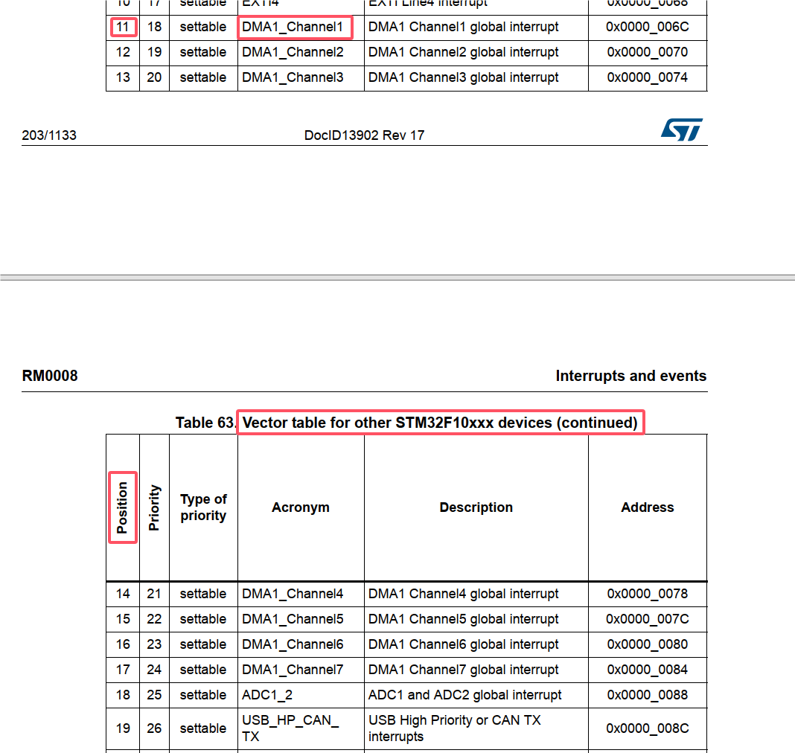

# 中断系统

## 中断概念

主程序运行过程中，中断源发出中断触发条件，使得CPU暂停当前运行的程序，转而处理中断程序，处理完成后，返回原来被暂停的位置继续运行。

## 中断源 = 中断通道

可以向CPU发出中断请求的外设：EXIT，TIM，ADC，USART，SPI，I2C，RTC

## 中断向量表（Vector Table）

## NVIC 嵌套中断向量控制器

内核外设

一个单片机一般都有 NVIC内核外设，通称为中断控制器。一般有以下寄存器：中断使能寄存器，中断挂起寄存器（Pending），中断优先级寄存器，中断挂起清除寄存器。

以 S32K3系列芯片为例，

ARM Cortex系列架构，一般都有 SCB，带有VTOR寄存器，称为中断向量表地址偏移寄存器，用于存储 中断向量表在内存中的起始地址，结合中断向量表中定义的各个中断函数的相对地址，可以将具体中断函数跳转到内存中的对应地址中执行。

## 中断能够被响应的最基本两要素

中断使能

中断标志位

响应中断后，要清除中断标志位，不然就会 CPU -> 中断处理 -> CPU -> 中断处理 -> ...

参考STM32F10xxx Cortex-M3编程手册.pdf（Cortex内核编程手册）：

找到NVIC的中断使能寄存器是ISER，中断清除寄存器是ICER等等，以及中断号与寄存器的映射关系。

再查STM32参考手册，找到中断源对应的具体中断号，比如DMA1的Channel1中断号是11，中断优先级是18。

图中可以判断出当前只有定时器TIM2被中断使能

寄存器也类似于SRAM，运行时可读可写，可以使用调试器更改寄存器中的值，使能/挂起某些中断。